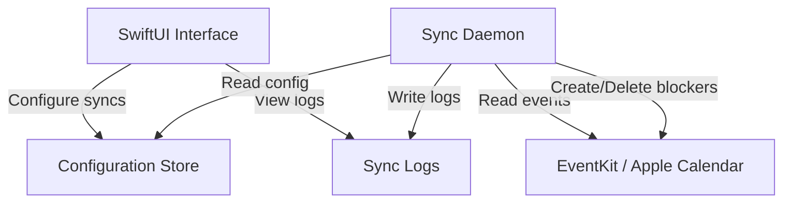

# CalMirror - Architecture Overview

**Last updated:** 2026-01-30

## Project Description

CalMirror is a native macOS application that mirrors calendar events between Apple Calendar accounts. It creates "blocker" events in a target calendar based on events from a source calendar, allowing users to see their true availability across multiple calendar providers (Google, Microsoft O365) without exposing sensitive event details.

## High-Level Architecture

## Components

### 1. UI Application
- **Purpose:** Configure sync rules, view status and logs
- **Technology:** SwiftUI (native macOS)
- **Responsibilities:**
  - List/create/edit/delete sync configurations
  - Display sync execution logs
  - Show sync status

### 2. Sync Daemon
- **Purpose:** Execute calendar synchronizations at regular intervals
- **Technology:** TBD (Swift service or launchd job)
- **Responsibilities:**
  - Read sync configurations
  - Fetch source calendar events within the configured time window
  - Create blocker events in target calendar (if not already present)
  - Remove blocker events whose source events no longer exist
  - Log all operations
- **Constraints:**
  - NEVER modify source calendar events
  - NEVER modify target calendar events that are not managed blockers

### 3. Configuration Store
- **Purpose:** Persist sync rule configurations
- **Technology:** TBD (UserDefaults, JSON file, or Core Data)

## Key Concepts

### Sync Configuration
A sync configuration defines:
- **Source calendar:** The calendar to mirror events from
- **Target calendar:** The calendar where blockers are created
- **Time window:** Rolling window (7d, 30d, etc.) for sync scope
- **Blocker label:** Text for blocker events (e.g., "[Client] Busy")

### Blocker Event
A simplified copy of a source event containing only:
- Start/end time (matching the source event)
- Title (the configured blocker label)
- A metadata identifier linking it to the source event (for lifecycle management)

## Security Considerations

- No event content (title, attendees, description) is replicated — only time slots
- No external SaaS dependency — works entirely through local Apple Calendar (EventKit)
- Client calendar data never leaves the machine

## Distribution

- Target: Homebrew cask for installation
- Single package containing both UI and daemon
