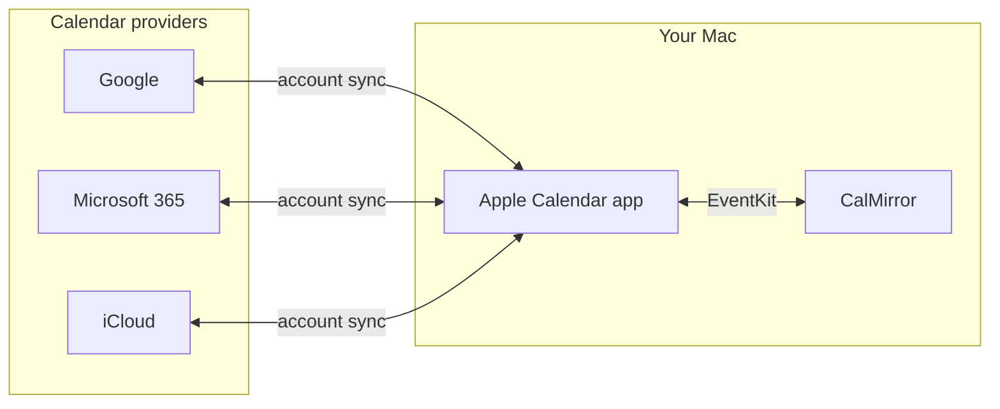

# CalMirror

[](https://github.com/gravitek-io/macos-calmirror/actions/workflows/ci.yml)
[](LICENSE)


CalMirror is a small native macOS app that makes your real availability
visible across calendar accounts. It reads the events of one calendar and
creates matching "blocker" events in another, so the busy slots of one
account show up in the other without sharing the event details.

Everything happens locally, through the calendars already configured in
Apple's **Calendar** app. CalMirror never connects to Google, Microsoft or any
cloud service.

## The problem it solves

Many of us juggle several calendar accounts: a personal Google calendar, a
work one, a client's Microsoft 365 tenant. When someone asks "when are you
free?", the honest answer depends on *all* of them, but each account only
knows about itself.

Scheduling services can merge accounts, but they require connecting every
account to a third-party SaaS. That is often impossible for a client or
employer calendar (company policy, blocked integrations) and not something
you want to do with confidential data anyway.

CalMirror takes a different route: since the Calendar app on your Mac can
already sync all of these accounts, CalMirror uses it as the bridge. Events
from the client calendar appear as blockers in the work calendar, the slots
are booked, and the details stay where they belong.

## How it works

**CalMirror works exclusively with the macOS Calendar app.** Both the source
and the target calendar are chosen among the calendars the Calendar app
already syncs on your Mac: iCloud, Google, Microsoft 365 / Exchange, CalDAV or
local calendars. CalMirror reads and writes them through Apple's EventKit
framework, and the Calendar app's own account sync then pushes the blockers up
to the target provider.



What this means in practice:

- **No credentials, no API keys, no OAuth.** If a calendar shows up in the
  Calendar app, CalMirror can use it. Adding an account to macOS is the only
  setup.
- **Works where SaaS integrations are blocked.** If your organisation lets you
  add the account to macOS Calendar but forbids third-party apps, CalMirror
  still works because it never talks to the provider itself.
- **Nothing leaves your Mac.** No telemetry, no remote calls.
- **Blockers reach the provider at the pace of the Calendar app's sync**, and
  the Mac must be awake for a sync to run.

### The sync cycle

A launchd agent runs `calmirror sync` every 15 minutes. For each rule it:

1. reads the source events inside the rule's sliding window (for example the
   next 30 days);
2. creates a blocker in the target calendar for every source event that does
   not have one yet;
3. updates blockers whose source event changed (time or, in mirror mode, title),
   detected through content hashing;
4. deletes blockers whose source event was cancelled or moved out of the window.

Two rules are enforced by design: the **source calendar is never modified**,
and in the target calendar CalMirror **only touches its own blockers**. Every
blocker carries a "Managed by CalMirror" tag in its notes; anything else in
the target calendar is left alone.

### Blocker titles

Each rule decides how its blockers are titled:

- **Mirror the source event name** (default): the blocker title is the rule
  title in brackets followed by the source event name, e.g. `[Acme] Tax meeting`.
  When a source event has no title, the blocker falls back to `[Acme] (No title)`.
  If a source event is later renamed, the blocker is updated on the next sync.
- **Fixed placeholder**: enable "Use a fixed placeholder" to title every blocker
  with a static label instead (e.g. `[Acme] Busy`), revealing nothing about the
  source event.

### Privacy

In mirror mode the source event **title** is copied into the blocker, and
only the title. Location, notes, attendees, URL, alarms and recurrence are
never copied in either mode. Choose the fixed placeholder if you do not want
event names to appear in the target calendar. Rules created before this
option existed keep using their fixed label.

## Requirements

- macOS 26 or later
- At least two calendars configured in the Calendar app (typically from two
  different accounts)
- An Apple Silicon Mac for the prebuilt release archives; building from source
  works on any Mac running macOS 26
- Xcode 26 or later, only if you build from source

## Installation

### From a release archive (recommended)

1. Download `calmirror-X.Y.Z-macos-arm64.tar.gz` from the
   [latest release](https://github.com/gravitek-io/macos-calmirror/releases/latest).
2. Extract it and run the bundled installer:

```bash
tar -xzf calmirror-X.Y.Z-macos-arm64.tar.gz
cd calmirror-X.Y.Z
./install.sh
```

The app bundle is ad-hoc signed and not notarized. If macOS refuses to open
it on first launch, allow it from **System Settings > Privacy & Security >
Open Anyway**, or right-click the app and choose **Open**.

### From source

```bash
git clone https://github.com/gravitek-io/macos-calmirror.git
cd macos-calmirror
./scripts/install.sh
```

Both installers set up the same three components:

| Component | Location | Purpose |
|-----------|----------|---------|
| GUI app | `/Applications/CalMirror.app` | Configure rules, view sync logs |
| CLI | `/usr/local/bin/calmirror` | Run sync manually or via launchd |
| launchd agent | `~/Library/LaunchAgents/com.gravitek.calmirror.sync.plist` | Automatic sync every 15 min |

Components can also be installed separately:

```bash
./install.sh --app   # GUI app only
./install.sh --cli   # CLI + launchd agent only
```

## First run

1. Open **CalMirror** from `/Applications` or Spotlight.
2. Grant **full calendar access** when prompted. Without it CalMirror can
   neither read the source nor write the blockers.
3. Create a rule: pick a source calendar, a target calendar, give the rule a
   short title (it prefixes every blocker) and set the sync window in days.
   Tick "Use a fixed placeholder" if you want a static label instead of the
   event names.
4. The launchd agent takes over and syncs every 15 minutes. Blockers appear in
   the target calendar on the Mac immediately, and on the provider side after
   the Calendar app's next sync.

To run a sync right away, or to preview what a sync would do:

```bash
calmirror sync
calmirror sync --dry-run
```

## Command line

The GUI and the CLI share the same rules and logs. Everything can be done from
the terminal:

| Command | Purpose |
|---------|---------|
| `calmirror calendars` | List the calendars available in the Calendar app, with their identifiers |
| `calmirror rules list` | Show configured rules |
| `calmirror rules add --title "Acme" --source <id> --target <id> --window 30` | Create a rule (add `--use-placeholder --label "Busy"` for a fixed label) |
| `calmirror rules enable <uuid>` / `disable <uuid>` / `remove <uuid>` | Manage a rule |
| `calmirror sync [--rule <uuid>] [--dry-run]` | Run a sync now |
| `calmirror logs [--limit N]` | Show recent sync executions |
| `calmirror status` | Show calendar access, agent state and rule summary |
| `calmirror agent install` / `uninstall` / `status` | Manage the launchd agent |
| `calmirror version` | Print the installed version |

Most commands accept `--json` for scripting. Run `calmirror --help` for the
full reference.

## Architecture

```
macos-calmirror/
├── Sources/
│   ├── CalmMirrorCore/          # Shared library
│   │   ├── Models/              # MirrorRule, SyncRecord, SyncLog
│   │   ├── Engine/              # SyncEngine, ContentHasher
│   │   ├── Storage/             # RuleStore, SyncRecordStore, SyncLogStore
│   │   └── Calendar/            # CalendarService, LaunchdManager
│   ├── CalmMirrorApp/           # SwiftUI windowed app
│   └── calmirror/               # CLI (Swift Argument Parser)
├── Tests/CalmMirrorCoreTests/   # Unit tests for the core library
├── Resources/                   # launchd plist template
├── scripts/                     # Install and release packaging scripts
├── docs/                        # Maintainer documentation
└── .github/                     # CI workflow, issue and PR templates
```

| Component | Purpose |
|-----------|---------|
| **CalmMirrorCore** | Models, sync engine, storage, calendar access |
| **CalmMirrorApp** | SwiftUI GUI for rule configuration and log viewing |
| **calmirror** | CLI invoked by launchd and for interactive use |

## Data storage

| Data | Location |
|------|----------|
| Rules | UserDefaults suite `com.gravitek.calmirror` |
| Sync records (source event to blocker mapping) | `~/Library/Application Support/CalMirror/sync/{ruleId}.json` |
| Sync logs | `~/Library/Application Support/CalMirror/logs/sync-logs.json` |
| launchd agent | `~/Library/LaunchAgents/com.gravitek.calmirror.sync.plist` |
| Agent stdout / stderr | `/tmp/calmirror.stdout.log`, `/tmp/calmirror.stderr.log` |

## Uninstall

```bash
# Stop and remove the agent
calmirror agent uninstall

# Remove installed files
rm -rf /Applications/CalMirror.app
sudo rm /usr/local/bin/calmirror
```

Deleting a rule (from the app or with `calmirror rules remove`) also removes
the blockers it created from the target calendar. Delete your rules before
uninstalling if you want the target calendar cleaned up.

## Development

```bash
swift build                     # build every target
swift test                      # run the unit tests
swift run calmirror calendars   # run the CLI from source
open Package.swift              # open in Xcode
```

The [dependencies](Package.swift) are limited to Apple frameworks (EventKit,
CryptoKit) and [Swift Argument Parser](https://github.com/apple/swift-argument-parser).

## Contributing

Contributions are welcome, from bug reports and provider compatibility
feedback to code. Please read [CONTRIBUTING.md](CONTRIBUTING.md) for the
workflow, the coding guidelines and the safety invariants every change must
respect, and [SECURITY.md](SECURITY.md) to report a security or privacy issue
privately.

Some ideas that would make good first contributions:

- a Homebrew tap for the CLI and app,
- a notarized build so Gatekeeper stops asking on first launch,
- an Intel (x86_64) or universal release archive,
- a configurable sync interval.

Releases are cut by maintainers following [docs/RELEASING.md](docs/RELEASING.md).

## License

CalMirror is released under the [Apache License 2.0](LICENSE).
