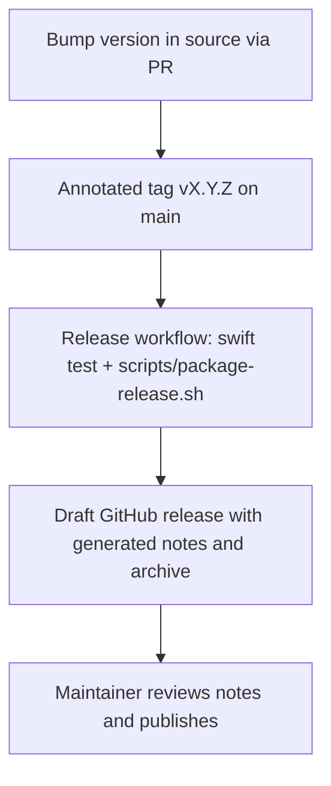

# Releasing CalMirror

This document describes how to cut a new CalMirror release. Building and
publishing are automated by the [Release workflow](../.github/workflows/release.yml);
the human steps are the version bump, the tag, and reviewing the release notes.

## Overview



A release ships a single asset, a `.tar.gz` containing a self-installing
directory:

```
calmirror-X.Y.Z/
  CalMirror.app   # ad-hoc code-signed GUI bundle
  calmirror       # CLI binary (arm64)
  install.sh      # prebuilt installer (from scripts/release-install.sh)
```

**Target platform:** macOS 26+, Apple Silicon (arm64). The workflow builds on
a `macos-26` GitHub runner, which is Apple Silicon.

## 1. Bump the version

Update **every** version reference so the app, CLI and library agree. Missing
one produces an inconsistent release.

| File | What to change |
|------|----------------|
| `Sources/CalmMirrorApp/Info.plist` | `CFBundleShortVersionString` and `CFBundleVersion` |
| `Sources/calmirror/CLI.swift` | `print("calmirror X.Y.Z")` in the `Version` command |
| `Sources/CalmMirrorCore/CalmMirrorCore.swift` | `public static let version = "X.Y.Z"` |
| `Tests/CalmMirrorCoreTests/CalmMirrorCoreTests.swift` | `testCoreLibraryVersion` asserts the version — keep it in sync |

After bumping, `swift test` must stay green (`testCoreLibraryVersion` guards the
library version).

Follow [SemVer](https://semver.org/): bug fixes → patch, backward-compatible
features → minor, breaking changes → major.

> The packaging script guards against a mismatched **CLI** version, so a
> forgotten bump fails the workflow instead of publishing a wrong version. It
> cannot check the other files — update them all.

## 2. Merge the bump and tag `main`

`main` only changes through pull requests, so the version bump lands like any
other change:

```bash
git checkout -b chore/release-X.Y.Z
git commit -am "chore(release): bump version to X.Y.Z"
git push -u origin chore/release-X.Y.Z
gh pr create --title "chore(release): bump version to X.Y.Z" --fill
```

Once the PR is merged, tag the resulting commit on `main` and push the tag:

```bash
git checkout main && git pull
git tag -a vX.Y.Z -m "vX.Y.Z — <one-line summary>"
git push origin vX.Y.Z
```

Pushing the tag triggers the Release workflow. Tags that do not point at a
commit on `main` are rejected by the workflow.

## 3. Let the workflow build the archive

The [Release workflow](../.github/workflows/release.yml) runs the tests, builds
the archive with `scripts/package-release.sh`, and creates a **draft** release
`vX.Y.Z` with:

- release notes generated from the pull requests merged since the previous tag,
- `calmirror-X.Y.Z-macos-arm64.tar.gz` attached.

Follow it from the Actions tab or with:

```bash
gh run list --workflow Release -R gravitek-io/macos-calmirror
```

If it fails, fix the cause, delete the tag locally and remotely
(`git tag -d vX.Y.Z && git push origin :vX.Y.Z`), and tag again once the fix
is merged. Re-running the workflow on an existing draft fails because the
release already exists; delete the draft first.

## 4. Review and publish

Open the draft on the [releases page](https://github.com/gravitek-io/macos-calmirror/releases)
and edit the generated notes to match the structure of previous releases: a
one-line summary, a "What's new" list, an Installation block, and a compare
link (`https://github.com/gravitek-io/macos-calmirror/compare/v<prev>...vX.Y.Z`).
Then publish.

## 5. Verify

```bash
gh release view vX.Y.Z -R gravitek-io/macos-calmirror
```

Confirm the asset is attached and, ideally, download it on a clean machine and
run `./install.sh` to smoke-test the install flow.

## Building locally

The same archive can be produced on an Apple Silicon Mac, for a smoke test
before tagging or as a fallback if the workflow is unavailable:

```bash
./scripts/package-release.sh            # version inferred from the HEAD tag
./scripts/package-release.sh X.Y.Z      # explicit version
```

The archive lands in `dist/` (git-ignored).
