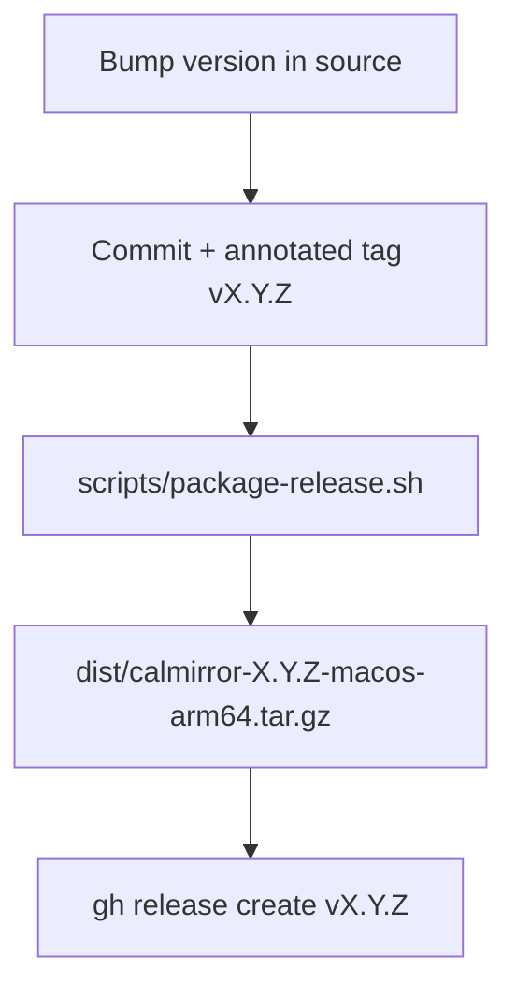

# Releasing CalMirror

This document describes how to cut a new CalMirror release. The packaging is
automated by [`scripts/package-release.sh`](../scripts/package-release.sh); the
human steps are the version bump, the changelog/notes, and publishing.

## Overview



A release ships a single asset, a `.tar.gz` containing a self-installing
directory:

```
calmirror-X.Y.Z/
  CalMirror.app   # ad-hoc code-signed GUI bundle
  calmirror       # CLI binary (arm64)
  install.sh      # prebuilt installer (from scripts/release-install.sh)
```

**Target platform:** macOS 14+ (Sonoma), Apple Silicon (arm64). Build on an
Apple Silicon Mac.

## 1. Bump the version

Update **every** version reference so the app, CLI and library agree. Missing
one produces an inconsistent release.

| File | What to change |
|------|----------------|
| `Sources/CalmMirrorApp/Info.plist` | `CFBundleShortVersionString` and `CFBundleVersion` |
| `Sources/calmirror/CLI.swift` | `print("calmirror X.Y.Z")` in the `Version` command |
| `Sources/CalmMirrorCore/CalmMirrorCore.swift` | `public static let version = "X.Y.Z"` |
| `Tests/CalmMirrorCoreTests/CalmMirrorCoreTests.swift` | `testCoreLibraryVersion` asserts the version — keep it in sync |
| `homebrew-tap/Formula/calmirror.rb` | `tag:` and the `assert_match` version (if the tap is published) |

After bumping, `swift test` must stay green (`testCoreLibraryVersion` guards the
library version).

Follow [SemVer](https://semver.org/): bug fixes → patch, backward-compatible
features → minor, breaking changes → major.

> The packaging script guards against a mismatched **CLI** version, but it
> cannot check the others — update them all.

## 2. Commit and tag

```bash
git commit -am "chore(release): bump version to X.Y.Z"
git tag -a vX.Y.Z -m "vX.Y.Z — <one-line summary>"
git push && git push --tags   # push only after your approval
```

The tag must point at the commit you intend to ship; `package-release.sh`
infers the version from the tag on `HEAD`.

## 3. Build the archive

```bash
./scripts/package-release.sh            # version inferred from the HEAD tag
# or
./scripts/package-release.sh X.Y.Z      # explicit version
```

The archive lands in `dist/` (git-ignored). The script ad-hoc code-signs the
app bundle and verifies the CLI reports the expected version.

## 4. Publish the GitHub release

Write release notes (mirror the structure of previous releases: a one-line
summary, a "What's new" list, an Installation block, and a compare link), then:

```bash
gh release create vX.Y.Z \
  -R gravitek-io/macos-calmirror \
  --title "CalMirror X.Y.Z" \
  --notes-file notes.md \
  dist/calmirror-X.Y.Z-macos-arm64.tar.gz
```

The compare link convention is
`https://github.com/gravitek-io/macos-calmirror/compare/v<prev>...vX.Y.Z`.

## 5. Verify

```bash
gh release view vX.Y.Z -R gravitek-io/macos-calmirror
```

Confirm the asset is attached and, ideally, download it on a clean machine and
run `./install.sh` to smoke-test the install flow.
