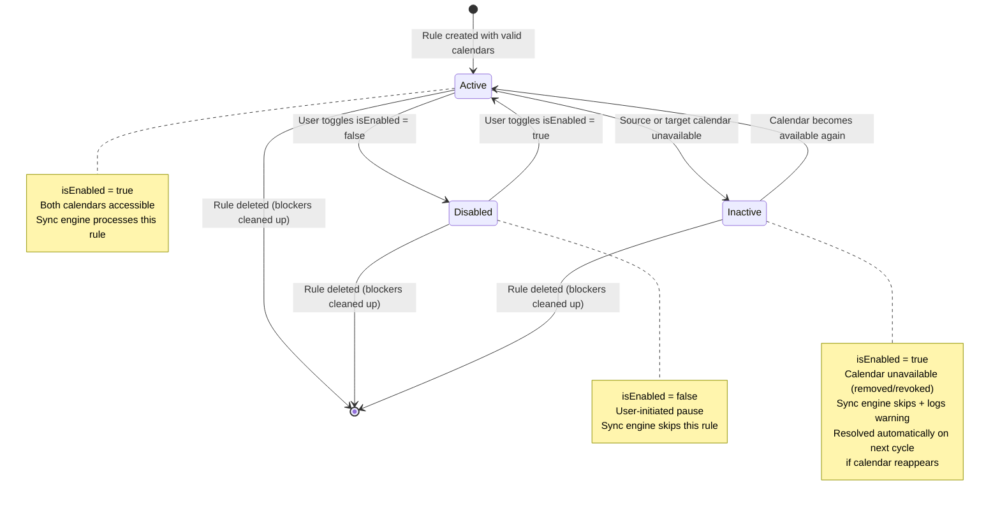
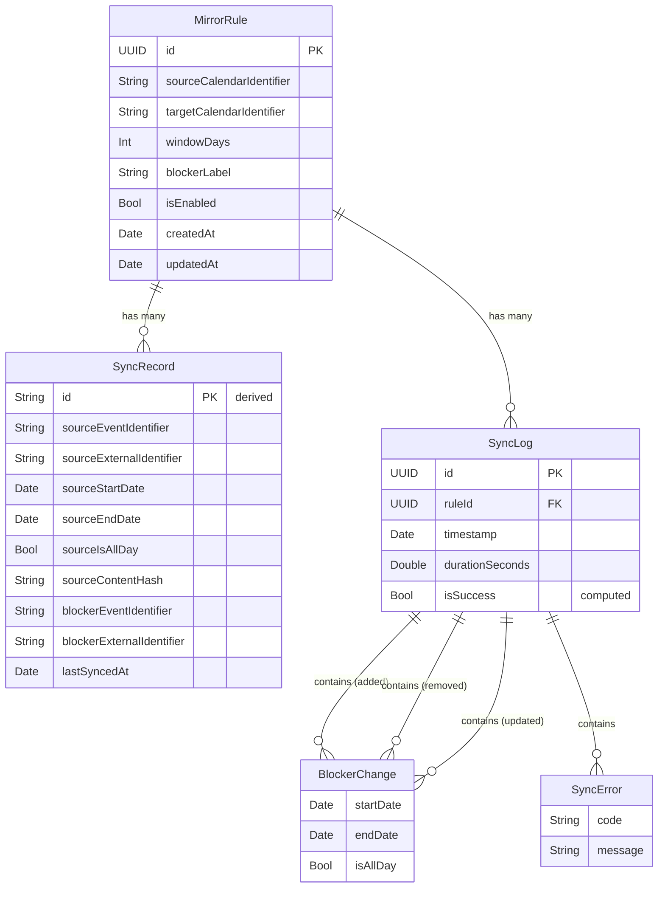
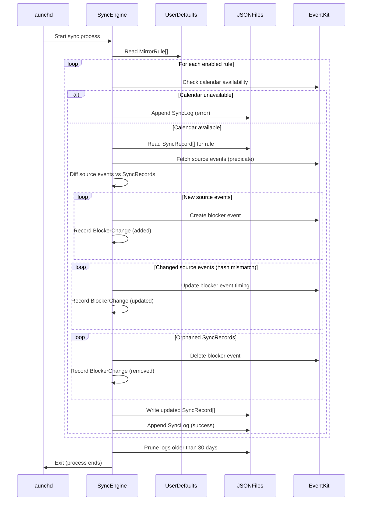

# Data Model: CalMirror

**Branch**: `001-calendar-mirror-app` | **Date**: 2026-01-30 | **Spec**: [spec.md](spec.md) | **Research**: [research.md](research.md)

## Overview

CalMirror persists three categories of data, each with a storage strategy suited to its access pattern and size:

| Entity       | Storage                                           | Shared Between App & CLI | Growth Pattern         |
| ------------ | ------------------------------------------------- | ------------------------ | ---------------------- |
| MirrorRule   | UserDefaults (shared suite `com.gravitek.calmirror`) | Yes (suite name)         | Fixed (user-managed)   |
| SyncRecord   | JSON file per rule                                | Yes (file system)        | Proportional to events |
| SyncLog      | JSON log file (rolling)                           | Yes (file system)        | Time-based, capped     |

## Entity Definitions

### MirrorRule

A user-configured pairing between a source calendar and a dedicated CalMirror target calendar, defining what to mirror and how to label blocker events.

```swift
import Foundation

/// A user-configured mirror rule that defines how events from a source calendar
/// are replicated as blocker entries in a dedicated target calendar.
///
/// Persisted in UserDefaults under the shared suite `com.gravitek.calmirror`.
/// The `targetCalendarIdentifier` points to a dedicated CalMirror calendar
/// created specifically for this rule within the user's chosen calendar account.
struct MirrorRule: Codable, Identifiable, Hashable, Sendable {

    /// Unique identifier for this rule.
    let id: UUID

    /// EKCalendar.calendarIdentifier of the source calendar to read events from.
    /// The sync engine treats this calendar as strictly read-only.
    let sourceCalendarIdentifier: String

    /// EKCalendar.calendarIdentifier of the dedicated CalMirror calendar
    /// where blocker events are created. This calendar is managed entirely
    /// by CalMirror and is created when the rule is first saved.
    let targetCalendarIdentifier: String

    /// Number of days forward from today defining the sliding sync window.
    /// Events within [today, today + windowDays] are considered for mirroring.
    /// Valid range: 1...120.
    var windowDays: Int

    /// Label text used as the title for every blocker event created by this rule.
    /// Example: "[Client] Busy". No source event data is included.
    var blockerLabel: String

    /// Whether this rule is enabled for automatic sync execution.
    /// Disabled rules are skipped during sync cycles but retain their configuration.
    var isEnabled: Bool

    /// Timestamp when this rule was first created.
    let createdAt: Date

    /// Timestamp of the most recent modification to this rule's configuration.
    var updatedAt: Date
}
```

**Validation rules:**
- `sourceCalendarIdentifier != targetCalendarIdentifier` (enforced at creation)
- `windowDays` must be in range `1...120` (EventKit predicate supports up to 4 years)
- `blockerLabel` must not be empty or whitespace-only

**State transitions:**



The `Inactive` state is not stored as a field on `MirrorRule`. It is a runtime condition detected by the sync engine when `EKEventStore.calendar(withIdentifier:)` returns `nil` for either the source or target calendar. The rule remains `isEnabled = true` so that sync resumes automatically when the calendar becomes available again.

**UserDefaults key:**

```swift
/// Key used to store the encoded array of MirrorRule in UserDefaults.
/// Suite: com.gravitek.calmirror
static let mirrorRulesKey = "mirrorRules"
```

---

### SyncRecord

A mapping between a single source event occurrence and its corresponding blocker event in the target calendar. Enables efficient change detection and orphan cleanup.

```swift
import Foundation

/// Maps a source event occurrence to the blocker event created for it.
///
/// Persisted in a JSON file specific to each MirrorRule.
/// Used by the sync engine to detect changes (via `sourceContentHash`),
/// update blocker timing, and clean up orphaned blockers.
struct SyncRecord: Codable, Identifiable, Sendable {

    /// Derived identifier combining rule ID and source event for uniqueness.
    /// Format: "{ruleId}_{sourceEventIdentifier}_{sourceStartDate.timeIntervalSince1970}"
    var id: String {
        "\(sourceEventIdentifier)_\(Int(sourceStartDate.timeIntervalSince1970))"
    }

    // MARK: - Source Event

    /// EKEvent.eventIdentifier of the source event.
    /// Primary lookup key. Stable within a single device.
    let sourceEventIdentifier: String

    /// EKEvent.calendarItemExternalIdentifier of the source event.
    /// Used as fallback when eventIdentifier changes (e.g., after Exchange sync).
    let sourceExternalIdentifier: String

    /// Start date of the source event occurrence.
    let sourceStartDate: Date

    /// End date of the source event occurrence.
    let sourceEndDate: Date

    /// Whether the source event is an all-day event.
    let sourceIsAllDay: Bool

    /// Hash of (startDate + endDate + isAllDay) for efficient change detection.
    /// When this hash differs from a live event's computed hash, the blocker
    /// needs to be updated to reflect the new timing.
    let sourceContentHash: String

    // MARK: - Blocker Event

    /// EKEvent.eventIdentifier of the blocker event created in the target calendar.
    /// Primary key for locating the blocker to update or delete.
    let blockerEventIdentifier: String

    /// EKEvent.calendarItemExternalIdentifier of the blocker event.
    /// Used as fallback when blockerEventIdentifier becomes stale.
    let blockerExternalIdentifier: String

    // MARK: - Metadata

    /// Timestamp of the last successful sync that created or updated this record.
    let lastSyncedAt: Date
}
```

**Content hash computation:**

```swift
import CryptoKit
import Foundation

/// Computes a deterministic hash from the source event's time properties.
/// Used for efficient change detection without comparing full event objects.
///
/// - Parameters:
///   - startDate: The event's start date.
///   - endDate: The event's end date.
///   - isAllDay: Whether the event spans the entire day.
/// - Returns: A hex-encoded SHA-256 hash string.
func computeContentHash(startDate: Date, endDate: Date, isAllDay: Bool) -> String {
    var hasher = SHA256()
    let startInterval = startDate.timeIntervalSince1970
    let endInterval = endDate.timeIntervalSince1970
    hasher.update(data: withUnsafeBytes(of: startInterval) { Data($0) })
    hasher.update(data: withUnsafeBytes(of: endInterval) { Data($0) })
    hasher.update(data: withUnsafeBytes(of: isAllDay) { Data($0) })
    let digest = hasher.finalize()
    return digest.map { String(format: "%02x", $0) }.joined()
}
```

**Fallback lookup strategy:**

When the sync engine needs to find an existing blocker event:
1. Look up by `blockerEventIdentifier` using `EKEventStore.event(withIdentifier:)`.
2. If `nil`, search by `blockerExternalIdentifier` using `EKEventStore.calendarItems(withExternalIdentifier:)`.
3. If still not found, treat the blocker as deleted externally and create a new one.

The same fallback applies when matching source events.

---

### SyncLog

A record of a single sync execution for a specific mirror rule, capturing what changed and any errors encountered.

```swift
import Foundation

/// Records the outcome of a single sync execution for one mirror rule.
///
/// Persisted in a shared JSON log file with rolling retention (last 30 days).
/// Displayed in the UI logs view for user troubleshooting.
struct SyncLog: Codable, Identifiable, Sendable {

    /// Unique identifier for this sync execution.
    let id: UUID

    /// The mirror rule that was executed.
    let ruleId: UUID

    /// Timestamp when this sync execution started.
    let timestamp: Date

    /// Wall-clock duration of the sync execution in seconds.
    let durationSeconds: Double

    /// Summary of blocker events that were created during this execution.
    let added: [BlockerChange]

    /// Summary of blocker events that were removed during this execution.
    let removed: [BlockerChange]

    /// Summary of blocker events that were updated (time changed) during this execution.
    let updated: [BlockerChange]

    /// Human-readable error descriptions encountered during execution.
    /// Empty array indicates a fully successful sync.
    let errors: [SyncError]

    /// Convenience computed property: total blockers added.
    var addedCount: Int { added.count }

    /// Convenience computed property: total blockers removed.
    var removedCount: Int { removed.count }

    /// Convenience computed property: total blockers updated.
    var updatedCount: Int { updated.count }

    /// Whether the sync completed without any errors.
    var isSuccess: Bool { errors.isEmpty }
}

/// Describes a single blocker event change (creation, deletion, or update).
struct BlockerChange: Codable, Sendable {

    /// Start date of the affected time slot.
    let startDate: Date

    /// End date of the affected time slot.
    let endDate: Date

    /// Whether this was an all-day event.
    let isAllDay: Bool
}

/// Describes an error that occurred during sync execution.
struct SyncError: Codable, Sendable {

    /// Machine-readable error category for filtering and grouping.
    let code: ErrorCode

    /// Human-readable description of what went wrong.
    let message: String

    /// Known error categories encountered during sync.
    enum ErrorCode: String, Codable, Sendable {
        /// Target calendar no longer exists in EventKit.
        case calendarNotFound
        /// Target calendar is read-only or permissions changed.
        case calendarReadOnly
        /// Calendar access has been revoked by the user or system.
        case accessDenied
        /// EventKit internal failure (retry-worthy).
        case eventKitInternal
        /// Failed to save or delete a specific blocker event.
        case blockerOperationFailed
        /// Unexpected error not covered by other codes.
        case unknown
    }
}
```

**Log retention:** Entries older than 30 days are pruned at the start of each sync cycle, before new logs are appended.

---

## Relationships



**Cardinality summary:**
- One `MirrorRule` produces zero or more `SyncRecord` entries (one per source event occurrence in the window).
- One `MirrorRule` produces zero or more `SyncLog` entries (one per sync execution).
- One `SyncLog` contains zero or more `BlockerChange` entries in each of its `added`, `removed`, and `updated` arrays.
- One `SyncLog` contains zero or more `SyncError` entries.

**Cascade behavior on rule deletion:**
- All `SyncRecord` entries for the rule are deleted (JSON file removed).
- All blocker events referenced by those records are deleted from the target calendar.
- `SyncLog` entries for the rule are retained for audit purposes (orphaned logs are cleaned up by the 30-day retention policy).

---

## Storage Layout

```text
~/Library/
├── Preferences/
│   └── com.gravitek.calmirror.plist          # UserDefaults shared suite
│                                              # Contains: MirrorRule[] (key: "mirrorRules")
│
├── Application Support/
│   └── CalMirror/
│       ├── sync/
│       │   ├── {ruleId-1}.json               # SyncRecord[] for rule 1
│       │   ├── {ruleId-2}.json               # SyncRecord[] for rule 2
│       │   └── ...                            # One file per active rule
│       │
│       └── logs/
│           └── sync-logs.json                 # SyncLog[] (rolling 30-day window)
│
└── LaunchAgents/
    └── com.gravitek.calmirror.sync.plist      # launchd agent configuration
```

### Storage Details

| Path | Format | Access Pattern | Size Estimate |
| ---- | ------ | -------------- | ------------- |
| `com.gravitek.calmirror.plist` | Binary plist (UserDefaults) | Read on launch, write on rule change | < 10 KB (tens of rules) |
| `CalMirror/sync/{ruleId}.json` | JSON array of `SyncRecord` | Full read/write each sync cycle | ~1 KB per 10 events |
| `CalMirror/logs/sync-logs.json` | JSON array of `SyncLog` | Append each cycle, prune on read | ~50 KB per 30 days (96 cycles/day x 30 days) |

### Directory Initialization

The `CalMirror/` directory tree under `Application Support` is created on first launch if it does not exist. The sync engine verifies directory existence before each write operation.

```swift
import Foundation

/// Returns the root directory for CalMirror's persistent data files.
/// Creates the directory structure if it does not already exist.
///
/// - Throws: If the directory cannot be created.
/// - Returns: URL to ~/Library/Application Support/CalMirror/
func calMirrorDataDirectory() throws -> URL {
    let appSupport = try FileManager.default.url(
        for: .applicationSupportDirectory,
        in: .userDomainMask,
        appropriateFor: nil,
        create: true
    )
    let root = appSupport.appendingPathComponent("CalMirror", isDirectory: true)
    let syncDir = root.appendingPathComponent("sync", isDirectory: true)
    let logsDir = root.appendingPathComponent("logs", isDirectory: true)

    for dir in [root, syncDir, logsDir] {
        if !FileManager.default.fileExists(atPath: dir.path) {
            try FileManager.default.createDirectory(
                at: dir,
                withIntermediateDirectories: true
            )
        }
    }
    return root
}
```

### File Naming Conventions

| File | Naming Pattern | Example |
| ---- | -------------- | ------- |
| Sync records | `{MirrorRule.id}.json` | `A1B2C3D4-E5F6-7890-ABCD-EF1234567890.json` |
| Sync logs | `sync-logs.json` (single file) | `sync-logs.json` |

### Concurrency and File Safety

- **Atomic writes:** All JSON file writes use `Data.write(to:options:.atomic)` to prevent corruption from interrupted writes (e.g., process killed mid-write, system sleep).
- **Single writer:** Only one sync process runs at a time (launchd `StartInterval` with no `KeepAlive` ensures sequential execution). No file locking is required.
- **UI reads during sync:** The UI reads sync records and logs independently. Since writes are atomic, the UI always sees a consistent snapshot (either the previous or the current version, never a partial write).

---

## Data Flow During Sync



---

## Design Decisions

| Decision | Rationale |
| -------- | --------- |
| UserDefaults for rules, JSON files for sync state | Rules are small and benefit from `@AppStorage` integration. Sync records can grow with event count and are better suited to file-based storage. |
| One JSON file per rule for SyncRecords | Isolates rule data; deleting a rule means deleting one file. Avoids loading all rules' records into memory. |
| Single JSON file for all SyncLogs | Logs are read chronologically across rules in the UI. A single file simplifies the log viewer query. Rolling retention keeps the file small. |
| Derived `SyncRecord.id` instead of stored UUID | The identity of a sync record is inherently tied to the source event it tracks. Using a derived ID from `sourceEventIdentifier` + `sourceStartDate` avoids duplicate records for the same event occurrence. |
| `SyncError.ErrorCode` enum | Structured error codes enable filtering in the UI (e.g., show only access errors) and programmatic retry decisions, while the `message` field provides human-readable context. |
| `Inactive` as runtime state, not persisted | Calendar availability is transient and can change between sync cycles. Persisting it would require constant reconciliation. Detecting it at runtime from EventKit is simpler and always accurate. |
| Atomic file writes, no file locking | The launchd agent runs sequentially (no concurrent sync processes). Atomic writes protect against corruption from process interruption without the complexity of advisory locks. |
